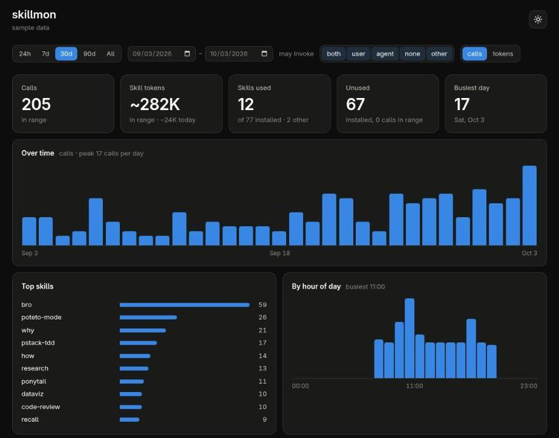

# skillmonitor

Find out which Claude Code skills you actually use.

skillmonitor records every skill call in a local SQLite database and shows how often each
skill was used in the last 1, 7, 30, 90 and 180 days. Installed skills you have never used
show up with zeros, so you can see what to clean up.

`skillmon web` opens the same data as an analytics page: calls over time, top skills, calls by
hour, filters for time range and invocation, and suggestions for what to clean up.



```
$ skillmon stats
┌───┬──────────────────┬────────────┬────┬────┬─────┬─────┬──────┐
│   │ skill            │ invocation │ d1 │ d7 │ d30 │ d90 │ d180 │
├───┼──────────────────┼────────────┼────┼────┼─────┼─────┼──────┤
│ 0 │ bro              │ both       │ 1  │ 3  │ 12  │ 30  │ 41   │
│ 1 │ ponytail-help    │ both       │ 0  │ 1  │ 1   │ 1   │ 1    │
│ 2 │ diagnosing-bugs  │ both       │ 0  │ 0  │ 0   │ 0   │ 0    │
└───┴──────────────────┴────────────┴────┴────┴─────┴─────┴──────┘
```

It counts both ways a skill can run: you typing `/some-skill`, and the model calling the
Skill tool.

## Requirements

| What        | Version          | Why                                                        |
| ----------- | ---------------- | ---------------------------------------------------------- |
| Claude Code | 2.1.288 or newer | The recorder is a Claude Code mod (`skill.prompt` hook)    |
| Bun         | 1.3 or newer     | Runs the `skillmon` CLI and provides SQLite (`bun:sqlite`) |
| git         | any              | To clone this repo                                         |
| OS          | Linux or macOS   | Install uses symlinks and `~/.local/bin`                   |

Nothing else is needed. There are no runtime npm dependencies and no separate SQLite install.
Older Claude Code versions are untested and may not support mods.

## Install

**1. Clone the repo.** Pick a place you'll keep it. The install links to these files, so
don't delete the folder afterwards.

```sh
git clone https://github.com/Maduki-tech/skillmonitor.git ~/skillmonitor
cd ~/skillmonitor
```

**2. Put the `skillmon` CLI on your PATH.**

```sh
mkdir -p ~/.local/bin
ln -s "$PWD/src/cli.ts" ~/.local/bin/skillmon
```

Check that it works:

```sh
skillmon stats
```

If you get `command not found`, add `~/.local/bin` to your PATH (for example
`export PATH="$HOME/.local/bin:$PATH"` in `~/.bashrc` or `~/.zshrc`) and open a new terminal.
If you get `env: 'bun': No such file or directory`, install Bun and make sure `bun` is on your
PATH too.

**3. Install the Claude Code mod.**

```sh
mkdir -p ~/.claude/skills
ln -s "$PWD/mod" ~/.claude/skills/skillmon
```

Claude Code loads plugin folders it finds in `~/.claude/skills/` in every session. No
marketplace or `/plugin install` step is needed.

**4. Check that recording works.** Start a new Claude Code session from a terminal where
`skillmon` works, run any skill (built-in commands like `/help` aren't skills and aren't
counted), then run:

```sh
skillmon stats
```

The skill should show `1` in the `d1` column.

## Usage

```sh
skillmon stats                          # usage table for all skills
skillmon web                            # analytics page on http://localhost:7171
skillmon record <skill> --agent <name> [--chars <n>]  # record a use by hand (the mod does this)
```

### Columns

| Column        | Meaning                                                                                                                 |
| ------------- | ----------------------------------------------------------------------------------------------------------------------- |
| `skill`       | Skill name, with any plugin prefix removed (`pstack:x` → `x`)                                                           |
| `invocation`  | Who may run it: `both`, `user` (only you), `agent` (only the model), `none`, or `-` if the skill is no longer installed |
| `d1` … `d180` | Number of uses in the last 1, 7, 30, 90 and 180 days                                                                    |

### Web view

`skillmon web` starts a local server on `localhost:7171` and opens it in your browser. It only
listens on your own machine. Reload the page to see the latest calls. Press Ctrl+C in the
terminal to stop it.

- **Filters:** time range (24h, 7d, 30d, 90d, All, or custom dates) and who may invoke the skill.
  `other` means a recorded skill with no `SKILL.md` on disk: a Claude Code built-in, or a skill
  you uninstalled.
- **Charts:** calls per day (per hour for ranges of two days or less), top 10 skills, and calls by
  hour of day. Hover a bar for the exact count.
- **Calls or tokens:** a switch in the filter row makes all three charts count estimated tokens
  instead of calls.
- **All skills:** sortable table with calls, share, token estimates and last use.
- **Suggestions:** skills that were never used, stopped being used, or were tried once. These
  use your whole history and ignore the filters.

### Token estimates

The page estimates two costs per skill:

| Cost        | What it is                                                        | Where it comes from                                                     |
| ----------- | ----------------------------------------------------------------- | ----------------------------------------------------------------------- |
| per call    | The skill's prompt text, added to the conversation when it runs   | Measured on every call. Before the first measured call: `SKILL.md` body |
| per session | Name and description the model sees in every session, used or not | `SKILL.md` frontmatter. `0` for skills only you can run (`/name` only)  |

The **Skill tokens** tile adds up the per-call cost of every call in the range, plus today's
total. Suggestions show what never-used skills cost per session.

These are estimates: tokens ≈ characters ÷ 4. They don't include anything a skill causes after
it loads, like files it reads or tools it calls. Calls recorded before skillmonitor measured
prompt size count at the skill's per-call size. Claude Code may shorten or extend the
per-session text, so treat that column as approximate.

## Where the data lives

Everything stays on your machine:

```
~/.local/share/skillmon/events.db
```

One row per skill use: skill name, agent (`claude-code`), a timestamp and the prompt size in
characters. skillmonitor keeps
its own copy because Claude Code deletes its transcripts after 30 days by default, which is
too short for the 90 and 180 day windows.

## Troubleshooting

- **The mod shows a toast "skillmon failed: ..."** The CLI ran but returned an error. Run
  `skillmon stats` in a terminal to see the full message.
- **Skills run but nothing is recorded.** Claude Code can't find `skillmon`. Claude Code runs
  it with the PATH it was started with, so start Claude Code from a terminal where
  `skillmon stats` works. Also check that `~/.claude/skills/skillmon` points at the repo's
  `mod/` folder (`ls -l ~/.claude/skills/skillmon`).

## Uninstall

```sh
rm ~/.claude/skills/skillmon ~/.local/bin/skillmon
rm -r ~/.local/share/skillmon   # also deletes your recorded history
```

## Development

```sh
bun install   # editor types and prettier only
bun test
```

See [docs/how-it-works.md](docs/how-it-works.md) for the call flow from Claude Code to the
database, with a diagram.
