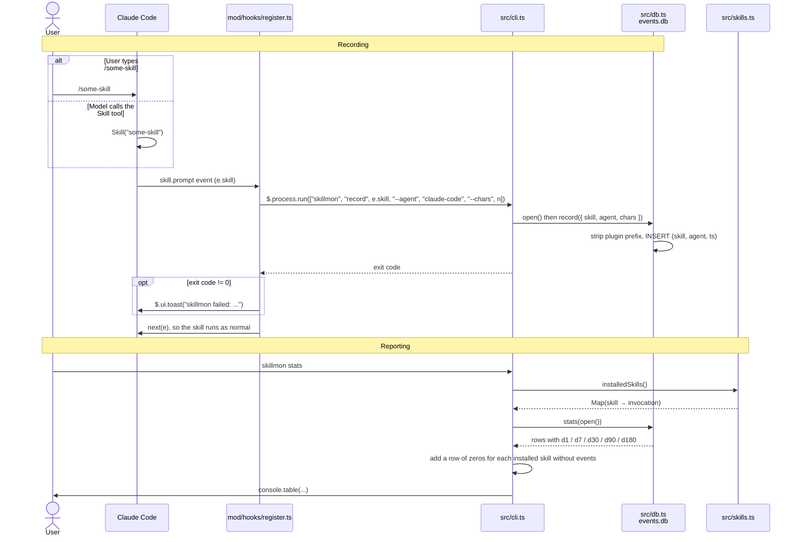
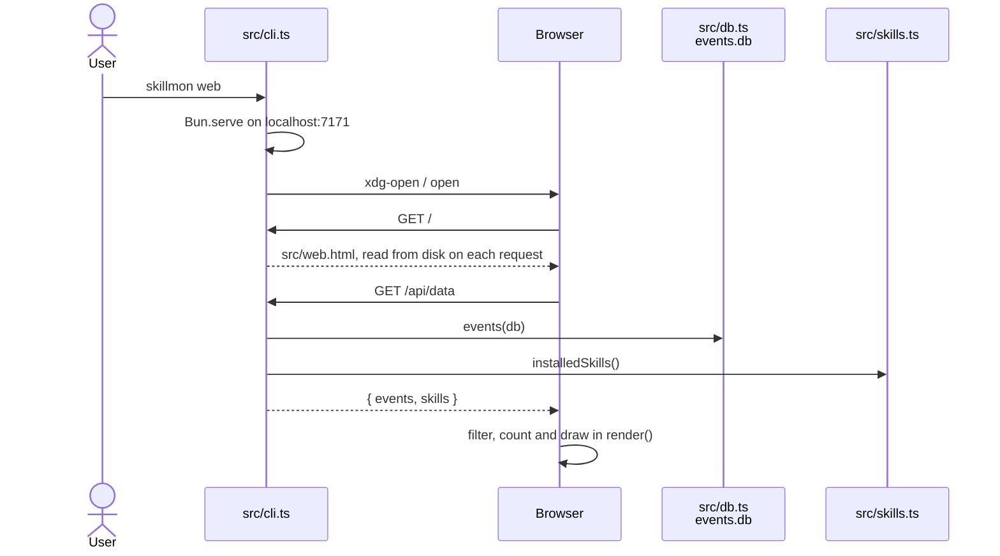

# How skillmon works

skillmon counts how often each agent skill is used over the last 1, 7, 30, 90 and 180 days.
It has two halves:

- **Recording.** A Claude Code plugin (`mod/`) runs `skillmon record` each time a skill runs.
- **Reporting.** `skillmon stats` reads the counts back and adds every installed skill that has
  never been used. `skillmon web` shows the same data as an analytics page in the browser.

## Call flow



## Recording, step by step

1. **Claude Code loads the plugin.** `~/.claude/skills/skillmon` is a symlink to `mod/`.
   Claude Code loads plugin folders it finds in `~/.claude/skills/` in every session, so no
   marketplace or install step is needed. `mod/.claude-plugin/plugin.json` names the plugin, and
   `mod/hooks/hooks.json` points at the one hook module, `register.ts`.

2. **A skill runs and the hook fires.** `register.ts` listens to `skill.prompt`. This event fires
   both when you type `/some-skill` and when the model calls the Skill tool. A `PreToolUse` hook
   would only see the second case.

3. **The hook calls the CLI.** The hook runs
   `skillmon record <skill> --agent claude-code --chars <n>` as a separate process. `n` is the
   length of `e.text`, the prompt text the skill adds to the conversation. `skillmon` is on your
   `PATH` through the symlink `~/.local/bin/skillmon` → `src/cli.ts`. The `#!/usr/bin/env bun`
   line at the top of `cli.ts` makes Bun run it.

4. **The CLI checks its arguments and writes.** `cli.ts` parses the arguments with `parseArgs`.
   For `record`, it needs a skill name and `--agent`. `--chars` is optional and must be a whole
   number of 0 or more. Otherwise it prints usage and exits with code 1. Then it calls
   `record()` in `db.ts`.

5. **`db.ts` stores one row.** `open()` creates `~/.local/share/skillmon/events.db` and the
   `events` table if they don't exist, and adds the `chars` column to databases from before it
   existed (see [Data](#data)). It sets `busy_timeout = 5000`, so when two sessions write at
   once, the second one waits instead of failing. `record()` removes any plugin prefix
   (`pstack:poteto-mode` → `poteto-mode`) and inserts `(skill, agent, ts, chars)` with the
   current Unix time in seconds.

6. **The skill continues.** The hook always returns `next(e)`, so a recording failure never
   blocks the skill. If the CLI exits with an error, you see a toast instead.

## Reporting, step by step

1. **`skillmon stats`** calls `installedSkills()` in `src/skills.ts`. That function looks for
   `*/SKILL.md` in:
    - `~/.claude/skills/` (symlinks are followed)
    - the `skills/` folder of every plugin listed in `~/.claude/plugins/installed_plugins.json`.
      The plugin cache also keeps old, uninstalled versions, so skillmon reads this list instead
      of scanning the cache.

    For each skill it parses the frontmatter with `Bun.YAML` and returns who may invoke it, the
    body length (`chars`) and the listing length (`listingChars`). A file whose frontmatter
    isn't valid YAML still counts as installed, with no flags and no description:

    | Frontmatter                      | `invocation` |
    | -------------------------------- | ------------ |
    | neither flag                     | `both`       |
    | `disable-model-invocation: true` | `user`       |
    | `user-invocable: false`          | `agent`      |
    | both flags                       | `none`       |

2. **`stats()`** in `db.ts` runs one query. It keeps events from the last 180 days, groups them
   by skill, and sums `ts > now - window` for each window. `now` is a parameter so the test can
   use a fixed time.

3. **Merging.** Each installed skill that has no events gets a row of zeros, so you can see
   which skills you never use. A skill with events but no installed folder shows `-` as its
   invocation.

## Web view, step by step



1. **The server is small on purpose.** `skillmon web` starts `Bun.serve` with two routes. `/`
   returns `src/web.html` as a plain file, so the page has no build step. `/api/data` returns
   every recorded call (`events()` in `db.ts`, `{ skill, ts, chars }`, oldest first) and the
   installed skills (`installedSkills()`, see below). The server keeps running until you press Ctrl+C.

2. **Every page load is fresh.** The page fetches `/api/data` once when it loads. Reload the page
   to see calls recorded since then.

3. **The browser does the analytics.** The server sends raw calls, not counts, so every filter
   runs in the browser without another request. The page keeps the filters in one `state`
   object. Each change calls `render()`, which filters the calls once and redraws the tiles,
   charts and table from that one list, so their numbers always agree.

4. **Invocation filter.** The hook can't tell whether you typed `/skill` or the model called it,
   so the filter uses who _may_ run a skill (the table above). Recorded skills with no
   `SKILL.md` on disk are `other`: Claude Code's built-in skills, or skills you uninstalled.

5. **Suggestions** use the whole history and ignore the filters. Each skill lands in at most one
   rule: never used (grouped by invocation), nobody can run it (`none`), stopped using (no call
   in 30 days), tried once (one call, over a week ago), or not installed. While there is less
   than 30 days of history, the page says to read "never used" as "not used yet".

6. **Tokens.** Tokens ≈ characters ÷ 4 (`tok()` in the page). Each skill's per-call size is the
   average `chars` of its measured calls, else its `SKILL.md` body length. Each call counts at
   its own `chars`, or at that per-call size for rows recorded before `chars` existed.
   `installedSkills()` also returns `listingChars`, the length of `name: description`. The
   model sees that text in every session, so it costs tokens even when the skill is never used.
   It is `0` when `disable-model-invocation: true`, because the model is never shown those
   skills.

7. **Theme.** The page follows the system light or dark setting. The toggle stores your choice
   in `localStorage`, and a small script in `<head>` applies it before the first paint.

## Data

```sql
events(skill TEXT NOT NULL, agent TEXT NOT NULL, ts INTEGER NOT NULL, chars INTEGER)
```

`chars` is the prompt size in characters, and `NULL` for rows from before it was recorded. It
stores the measurement, not a token estimate, so the estimate can change without rewriting old
rows. `open()` runs `ALTER TABLE events ADD COLUMN chars INTEGER` every time. On a database
that already has the column, SQLite answers "duplicate column name", and `open()` ignores
exactly that error. That way two sessions that open an old database at the same moment can't
break each other.

There is one row per use. skillmon keeps its own copy because Claude Code deletes its
transcripts after 30 days by default (`cleanupPeriodDays`), which is too short for the 90 and
180 day windows. The `agent` column is there so other tools can record into the same table
later.

## Files

| Path                             | Role                                           |
| -------------------------------- | ---------------------------------------------- |
| `mod/.claude-plugin/plugin.json` | Plugin manifest                                |
| `mod/hooks/hooks.json`           | Lists the hook modules                         |
| `mod/hooks/register.ts`          | `skill.prompt` hook that calls the CLI         |
| `src/cli.ts`                     | `skillmon record`, `stats` and `web`           |
| `src/db.ts`                      | SQLite open, `record()`, `stats()`, `events()` |
| `src/web.html`                   | The analytics page, one file, no build step    |
| `src/skills.ts`                  | Finds installed skills and their invocation    |
