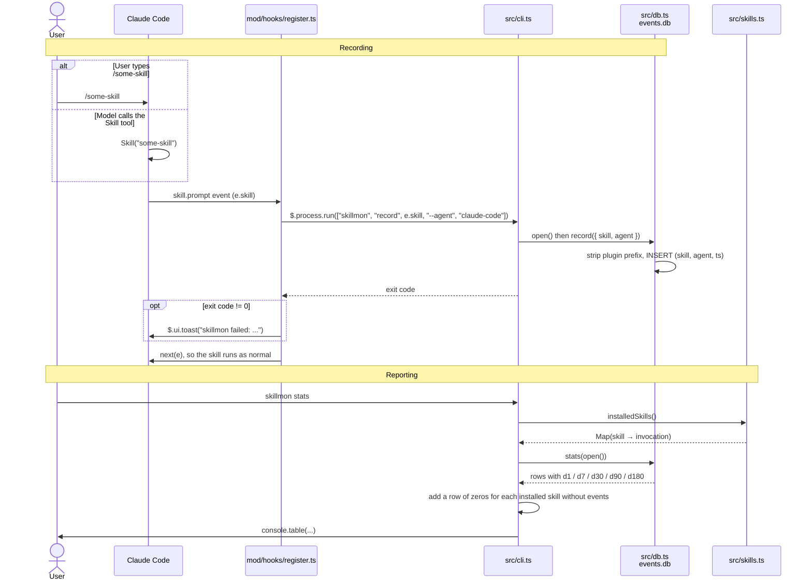

# How skillmon works

skillmon counts how often each agent skill is used over the last 1, 7, 30, 90 and 180 days.
It has two halves:

- **Recording.** A Claude Code plugin (`mod/`) runs `skillmon record` each time a skill runs.
- **Reporting.** `skillmon stats` reads the counts back and adds every installed skill that has
  never been used.

## Call flow



## Recording, step by step

1. **Claude Code loads the plugin.** `~/.claude/skills/skillmon` is a symlink to `mod/`.
   Claude Code loads plugin folders it finds in `~/.claude/skills/` in every session, so no
   marketplace or install step is needed. `mod/.claude-plugin/plugin.json` names the plugin, and
   `mod/hooks/hooks.json` points at the one hook module, `register.ts`.

2. **A skill runs and the hook fires.** `register.ts` listens to `skill.prompt`. This event fires
   both when you type `/some-skill` and when the model calls the Skill tool. A `PreToolUse` hook
   would only see the second case.

3. **The hook calls the CLI.** The hook runs
   `skillmon record <skill> --agent claude-code` as a separate process. `skillmon` is on your
   `PATH` through the symlink `~/.local/bin/skillmon` → `src/cli.ts`. The `#!/usr/bin/env bun`
   line at the top of `cli.ts` makes Bun run it.

4. **The CLI checks its arguments and writes.** `cli.ts` parses the arguments with `parseArgs`.
   For `record`, it needs a skill name and `--agent`, otherwise it prints usage and exits with
   code 1. Then it calls `record()` in `db.ts`.

5. **`db.ts` stores one row.** `open()` creates `~/.local/share/skillmon/events.db` and the
   `events` table if they don't exist. It sets `busy_timeout = 5000`, so when two sessions
   write at once, the second one waits instead of failing. `record()` removes any plugin prefix
   (`pstack:poteto-mode` → `poteto-mode`) and inserts `(skill, agent, ts)` with the current
   Unix time in seconds.

6. **The skill continues.** The hook always returns `next(e)`, so a recording failure never
   blocks the skill. If the CLI exits with an error, you see a toast instead.

## Reporting, step by step

1. **`skillmon stats`** calls `installedSkills()` in `src/skills.ts`. That function looks for
   `*/SKILL.md` in:
    - `~/.claude/skills/` (symlinks are followed)
    - the `skills/` folder of every plugin listed in `~/.claude/plugins/installed_plugins.json`.
      The plugin cache also keeps old, uninstalled versions, so skillmon reads this list instead
      of scanning the cache.

    For each skill it reads the frontmatter to find out who may invoke it:

    | Frontmatter                      | `invocation` |
    | -------------------------------- | ------------ |
    | neither flag                     | `both`       |
    | `disable-model-invocation: true` | `user`       |
    | `user-invocable: false`          | `agent`      |
    | both flags                       | `none`       |

2. **`stats()`** in `db.ts` runs one query. It keeps events from the last 180 days, groups them
   by skill, and sums `ts > now - window` for each window. `now` is a parameter so the test can
   use a fixed time.

3. **Merging.** Each installed skill that has no events gets a row of zeros, so you can see
   which skills you never use. A skill with events but no installed folder shows `-` as its
   invocation.

## Data

```sql
events(skill TEXT NOT NULL, agent TEXT NOT NULL, ts INTEGER NOT NULL)
```

There is one row per use. skillmon keeps its own copy because Claude Code deletes its
transcripts after 30 days by default (`cleanupPeriodDays`), which is too short for the 90 and
180 day windows. The `agent` column is there so other tools can record into the same table
later.

## Files

| Path                             | Role                                        |
| -------------------------------- | ------------------------------------------- |
| `mod/.claude-plugin/plugin.json` | Plugin manifest                             |
| `mod/hooks/hooks.json`           | Lists the hook modules                      |
| `mod/hooks/register.ts`          | `skill.prompt` hook that calls the CLI      |
| `src/cli.ts`                     | `skillmon record` and `skillmon stats`      |
| `src/db.ts`                      | SQLite open, `record()`, `stats()`          |
| `src/skills.ts`                  | Finds installed skills and their invocation |
